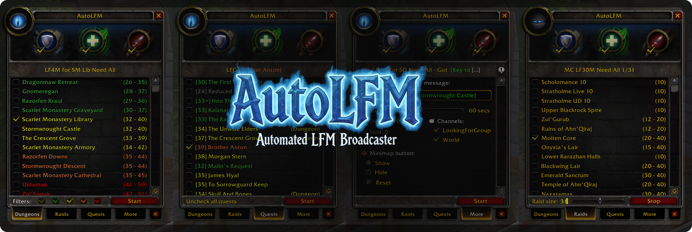

# AutoLFM - Automated LFM Broadcaster for WoW Vanilla 1.12 (TurtleWoW)

<p align="center">
  
</p>

## 📖 Description

**AutoLFM** is a powerful World of Warcraft 1.12 (Vanilla) addon that automates the process of broadcasting "Looking For More" (LFM) messages for dungeons, raids, quests and more. This addon helps group leaders efficiently recruit party members without manual spam.

> **🐢 Turtle WoW Specific**  
 While this addon works on any WoW 1.12 client, it was specifically designed for Turtle WoW and includes content from that server (custom dungeons, raids, and features).  
The interface design is inspired by and matches Turtle WoW's native LFG system.

## ✨ Features

- 🎯 **Smart Content Selection**
  - Browse and select from all Vanilla and customs dungeons/raids
  - Add quest links directly from your quest log
  - Color-coded level filtering

- 🎭 **Role Management**
  - Tank, Healer, DPS role indicators
  - Visual role selector with icons
  - Automatic message formatting

- ⚙️ **Customizable Broadcasting**
  - Adjustable broadcast interval (30-120 seconds)
  - Multiple channel support (LookingForGroup, World, etc.)
  - Custom message additions
  - Live message preview

- 🎨 **Intuitive Interface**
  - Clean tabbed navigation (Dungeons/Raids/Quests/More)
  - Minimap button with draggable positioning
  - Eye-catching broadcast animation

- 📊 **Statistics Tracking**
  - Broadcast duration timer
  - Message count
  - Next message countdown

## 📥 Installation

Use Addon install system from TurtleWoW launcher.

Or, manually:
1. Download the latest release
2. Extract the `AutoLFM` folder to your `Interface\AddOns` directory
3. Restart WoW or reload UI (`/reload`)
4. Type `/lfm` to open the interface

## 🎮 Usage

### Quick Start

1. **Open the interface**: `/lfm` or click the minimap button
2. **Select content**: 
   - Navigate to Dungeons/Raids/Quests tabs
   - Check the content you want to recruit for
3. **Choose roles**: Click Tank/Healer/DPS icons (optional)
4. **Select channels**: Go to "More" tab, check desired channels
5. **Start broadcasting**: Click the "Start" button

### Commands

```bash
/lfm                    # Toggle main window
/lfm help               # Show all commands

# Minimap button
/lfm minimap show       # Show minimap button
/lfm minimap hide       # Hide minimap button
/lfm minimap reset      # Reset button position

# Misc modules
/lfm misc status        # Show all modules status
/lfm misc help          # List all misc commands

# API (for developers)
/lfm api status         # Check API availability
/lfm api data           # Show current API status
/lfm api debug          # Show detailed debug information
/lfm api callbacks      # List registered callbacks
```

## 🏗️ Architecture

```
AutoLFM/
├── API/                         # Public API for external addons
│   ├── AutoLFM_Example/         # Ready-to-use example addon
│   ├── API.lua                  # API implementation (v2.0)
│   ├── CHANGELOG.md             # API version history
│   └── README.md                # Complete API documentation
│
├── Core/                        # Core systems
│   ├── Commands.lua             # Slash commands system (/lfm)
│   ├── Events.lua               # WoW event handling (PARTY_MEMBERS_CHANGED, etc.)
│   ├── Settings.lua             # SavedVariables management per character
│   └── Utils.lua                # Utilities, constants, colors, chat output
│
├── Logic/                       # Business logic
│   ├── Broadcaster.lua          # Message building and broadcasting engine
│   ├── Content.lua              # Dungeon/Raid/Quest databases and management
│   └── Selection.lua            # Selection state (roles, channels, group)
│
├── Misc/                        # Optional utility modules
│   ├── AutoInvite.lua           # Auto-invite players on whisper keyword
│   ├── AutoMarker.lua           # Auto raid icon assignment
│   ├── EasterEgg.lua            # Fun hidden features
│   ├── FPSDisplay.lua           # FPS/latency display
│   ├── GuildSpam.lua            # Guild chat broadcaster
│   ├── RestedXP.lua             # Rested XP monitor
│   └── README.md                # Complete misc documentation
│
├── UI/                          # User interface
│   ├── Components/              # Reusable UI components
│   │   ├── IconAnimation.lua    # Eye animation during broadcast
│   │   ├── LinkIntegration.lua  # Quest/Item links integration (Shift+Click)
│   │   ├── MainWindow.lua       # Main frame, roles selector, preview
│   │   ├── MinimapButton.lua    # Draggable minimap button
│   │   ├── PanelBuilder.lua     # UI builder (panels, scrolls, checkboxes)
│   │   └── TabNavigation.lua    # Tab system (Dungeons/Raids/Quests/More/Clear)
│   ├── Sounds/                  # Audio files (.ogg)
│   ├── Textures/                # Visual assets (.blp)
│   ├── ClearTab.lua             # Clear all selections (action tab)
│   ├── DungeonsPanel.lua        # Dungeon list with level filters
│   ├── MorePanel.lua            # Settings (interval, channels, minimap, stats)
│   ├── QuestsPanel.lua          # Quest log integration panel
│   └── RaidsPanel.lua           # Raid list with size controls
│
├── AutoLFM.png                  # Addon preview image
├── AutoLFM.toc                  # Addon manifest
├── CHANGELOG.md                 # Versioning history
├── Init.lua                     # Initialization and startup sequence
└── README.md                    # This file
```

## 🎨 Features Detail

### Dungeon Panel
- **Smart filtering** by level color (gray/green/yellow/orange/red)
- **Auto-sorting** by player level relevance
- **Multi-selection** (up to 4 dungeons)
- **Level ranges** displayed for each dungeon

### Raid Panel
- **Single selection** (one raid at a time)
- **Variable group sizes** for applicable raids
- **Dynamic slider** for 10-40 player raids
- **Fixed sizes** for specific content

### Quest Panel
- **Direct integration** with quest log
- **Shift+Click** to add quest links
- **Item links** from bags (Shift+Click)
- **Chat links** from chat frame (Shift+Click)

### More Panel
- **Interval control** with visual slider
- **Channel management** with checkboxes
- **Statistics display** (duration, sent, next)
- **Minimap controls** (show/hide/reset)
- **Custom message** editor

### Clear Tab
- **One-click clear** all selections (dungeons, raids, roles, messages)
- **Visual feedback** with color indicators (gray/orange/red)
- **Smart detection** of active selections
- **Tooltip** confirmation on hover

## 🔌 Extensions

### Misc Modules
Optional utility modules.

**📖 [Complete Misc Modules Documentation →](Misc/README.md)**

### Public API
AutoLFM exposes a comprehensive public API for integration with other addons.

**📖 [Complete API Documentation →](API/README.md)**

## ⚙️ Configuration
Settings are automatically saved per character in `SavedVariables/AutoLFM.lua`.

Configuration includes:
- Broadcast interval and channels
- Minimap button position
- Dungeon level filters
- Misc modules states and settings

## 📝 Information
- **WoW Version**: 1.12.1 (Interface 11200)
- **Lua Version**: 5.0
- **External Libraries**: None
- **Original Author**: Gondoleon

Contributions are welcome!
