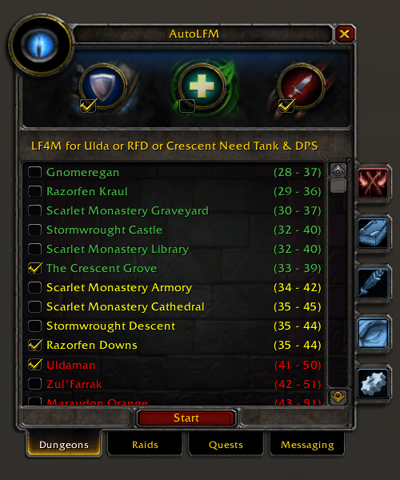
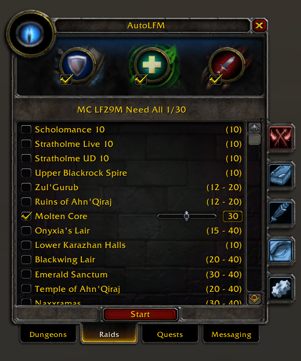
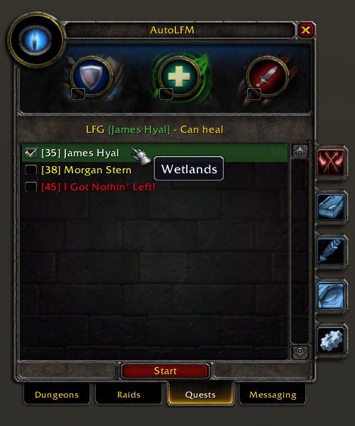
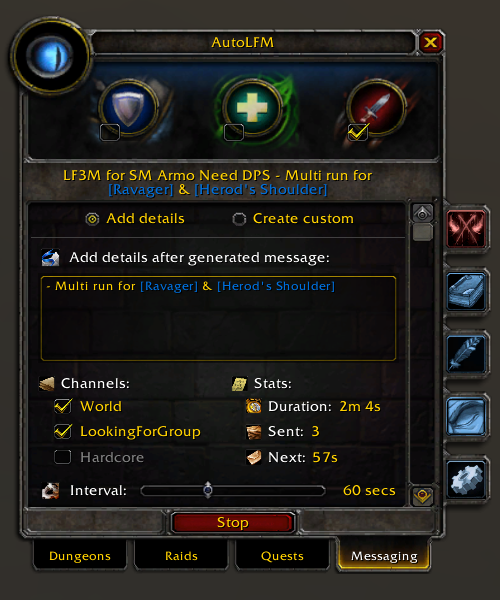
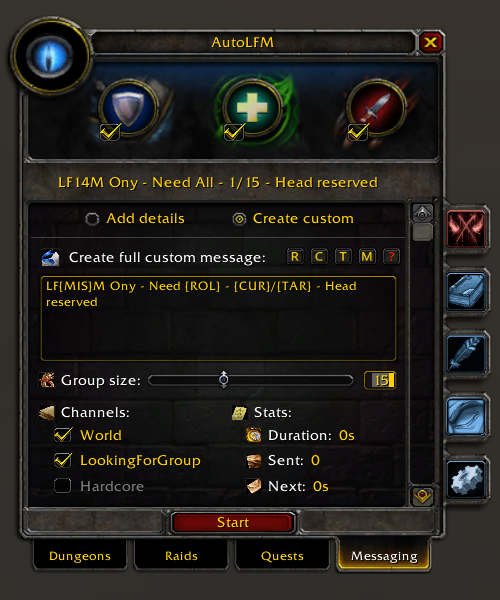
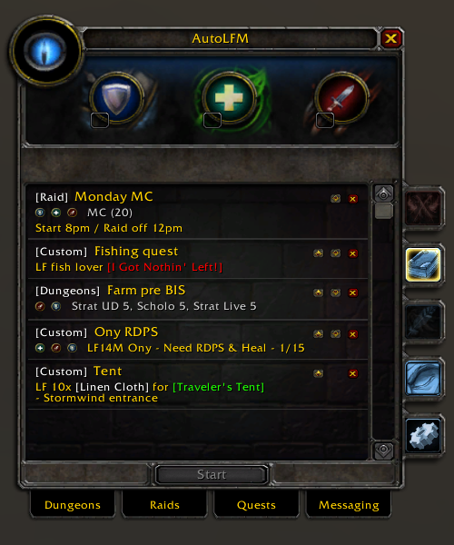
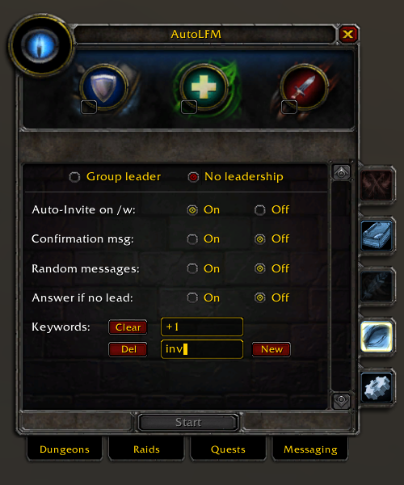

# AutoLFM - Automated LFM Broadcaster for WoW Vanilla 1.12 (TurtleWoW)

  

## 📜 Description
AutoLFM is a powerful World of Warcraft 1.12 (Vanilla) addon that automates the process of broadcasting "Looking For More" (LFM) messages for dungeons, raids, quests and more. This addon helps group leaders efficiently recruit party members without manual spam.

**🐢 Turtle WoW Specific**
- Specifically designed for Turtle WoW with content from that server (custom dungeons, raids, and features)
- Interface design matches Turtle WoW's native LFG system
- Works on any WoW 1.12 client

## 📖 Documentation
- **Users**: [Installation & Usage Guide](_Docs/Installation-Usage.md) - How to install and use AutoLFM
- **Developers**: [Developer Guide](_Docs/Dev/README.md) - Architecture, best practices, and component registry
- **Doc Structure**: [Documentation Structure](_Docs/Dev/Documentation-Structure.md) - Overview of all docs and how they relate

## ✨ Features
### 🎯 Content Selection
- Browse all Vanilla and Turtle WoW custom instances (dungeons and raids)
- Multi-selection support with smart filtering by difficulty color (GRAY/GREEN/YELLOW/ORANGE/RED)
- Quest log integration: add quest/item/chat links via Shift+Click
- 5-tab navigation system with quick access via `/lfm` command or minimap button
- Variable group sizes for applicable raids (10-40 slider)
- Customizable minimum group size for dungeons and raids

### 📢 Broadcasting & Messages
- Adjustable broadcast interval (30-120 seconds) with multiple channel support
- Automatic start/stop based on group status
- Live message preview before broadcasting
- Two message modes: **Details mode** (auto-formatted) or **Custom mode** (fully customizable)
- Role management: Tank/Healer/DPS visual selector with automatic formatting
- Real-time statistics: duration timer, message count, next broadcast countdown
- Configurable preview display (1 or 2 lines)

### 💾 Presets System
- Save unlimited preset configurations with one click
- Preset data includes: content selection, group size, roles, channels, broadcast interval, and messages
- Load presets instantly to quickly switch between different LFM setups
- Rename, reorder, and delete presets
- Condensed view mode for easier preset management

### 🎨 Interface & Controls
- Eye-catching broadcast animation with color indicators
- Draggable minimap button with position memory
- One-click clear all selections with smart detection
- Tooltip guidance throughout the interface
- Optional dark mode (ShaguTweaks integration)
- Dry run mode for testing broadcasts without sending messages

### 🤖 Auto-Invite System
- Automatically respond to whisper keywords with group invitations
- Configurable invitation keywords (default: "+1")
- Random invitation messages for personality (or simple confirmation)
- Optional confirmation whispers to invited players
- Smart leader check: respond only when you're group leader (configurable)
- Real-time keyword matching and filtering

## 🚀 Quick Start
1. **Install**: Extract into your WoW `Interface/AddOns/` folder
2. **Enable**: Type `/lfm` in-game to open the interface (or click minimap button)
3. **Select Content**: Navigate to Dungeons/Raids/Quests tabs and check desired content
4. **Choose Roles**: Click Tank/Healer/DPS icons (optional)
5. **Set Message Mode**: Choose between Details (auto-formatted) or Custom message mode
6. **Configure**: Select channels and broadcast interval in Settings tab
7. **Save as Preset** (optional): Click "Presets" tab to save your setup for quick reuse
8. **Start Broadcasting**: Click the "Start" button
9. **Enable Auto-Invite** (optional): Go to Settings tab to configure auto-response keywords

For detailed instructions, see [Installation & Usage Guide](_Docs/Installation-Usage.md).

## 🏗️ Architecture
AutoLFM uses the **Maestro CQRS command bus system** for clean architecture:
- **Core/**: Framework (Maestro command bus, Events, Utils, Storage)
- **Components/**: System components
- **Logic/**: Business logic (Broadcaster, Content, Selection, State management)
- **UI/**: User interface (Templates, Content panels, Controls)
For detailed architecture, see [Developer Guide](_Docs/Dev/README.md).

## 💾 Configuration
Settings are automatically saved per character in `SavedVariables/AutoLFM.lua`:
- **Broadcasting:** Interval (30-120s), chat channels
- **Content:** Dungeon filters (GRAY/GREEN/YELLOW/ORANGE/RED), default panel
- **Interface:** Minimap position, dark mode, message preview lines
- **Messages:** Simple vs Custom mode
- **Presets:** Saved presets, condensed view
- **Auto-Invite:** Keywords, random messages, reply confirmation
- **Other:** Dry run mode, welcome popup, hardcore detection

## 📸 Screenshots

  
  
  
  

  
  
  
  

## ℹ️ Information
- **WoW Version**: 1.12 (Interface 11200)
- **Lua Version**: 5.0
- **External Libraries**: None

Contributions are welcome! Please feel free to submit issues or pull requests.
